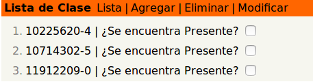

# Project "Student List"

This project consists of the creation of a simple book class for a school or college.
The objective is list all the student, add and delete student, and mark as present.

The frontend was made in React, and the backend in Ruby on Rails. The communication between both is controlled with GraphQl

## Getting Started

This project is for my postulation to Papinotas.

The principal idea is to get a list of student, mark as present or not. Also add new student into de database with his number list or delete a student if is no longer necessary to have in the system.

### Code Example

To use the application is necessary to have the both services running.
Then access to the url, in this case the ulr is localhost at 3000 port.

http://localhost:3000

There you can select a check box and mark a student present.

Create a student or delete.

Modify a student

### Prerequisites

This project was developed in Linux - Ubuntu 16.04
To execute the application and all the project is necessary have
 
* Ruby 2.3.1 (x86_64-linux-gnu)
* Ruby on Rails Guides (v5.2.1)
* Yarn 
* npm

* `$ sudo apt-get install ruby-full`
* `$ sudo apt-get install curl`
* `$ npm install npm -g `
* `$ curl -sS https://dl.yarnpkg.com/debian/pubkey.gpg | sudo apt-key add -`
* `$ echo "deb https://dl.yarnpkg.com/debian/ stable main" | sudo tee /etc/apt/sources.list.d/yarn.list`
* `$ sudo apt-get update && sudo apt-get install yarn`

### Installing

Is necessary to have

`yarn add apollo-boost react-apollo graphql-tag graphql`

`npm install react-router react-router-dom --save`

`yarn add react-router react-router-dom`

To start the Backend
`$ backend/rails s -p 3001`

To start the Frontend
`$ frontend/yarn start`

## Running the tests
To run the test in the backend go to
`$ backend/rails test test/models/student_test.rb`

## How to use?

Once you have both application running, go to your local host by defect`http://localhost:3000` on the frontend.  Here you can access to the app,  navigate and select witch function do you want.

The first option is select if one student is present or not. Ordered by his list number.

In `Agregar` you can add a new student with his rut and list number. The next option `Eliminar` allow to delete a student from the database, with his rut. 

Finally `Modificar` list all the students, to modify or delete.

Modify student is not implemented yet. =[

## Built With

* [Ruby](https://www.ruby-lang.org/en/) - For ruby on rails
* [Ruby on Rails](https://rubyonrails.org/) - Backend
* [React](https://reactjs.org/) - Frontend
* [Graphql](https://graphql.org/) - Middleware

## Assumptions
* There is only one list
* The date or day is only one
* If a Student is delete there is no longer into the database
* It should be only one rut for student, but the number list can be repeated

## Future work
* Add a date option
* Finalize edit option
* Learn more react owo

